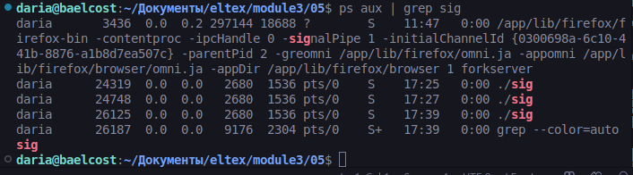
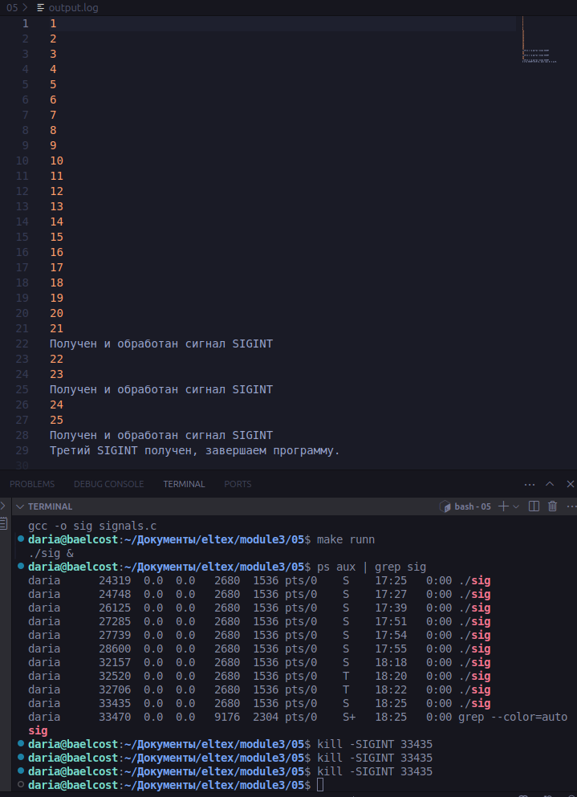

## Скриншоты и комментарии

- *Запускаем программу в фоновом режиме с помощью './sig &' и узнаем PID с помощью 'ps aux | grep sig'*

- *Обрабатывем сигнал SIGINT, используя Ctrl+C или 'kill -SIGINT PID'. В файле получаем сообщения о получении сигнала. После третьего SIGINT программа выводит сообщение о завершении и выходит.*

- *Обрабатывем сигнал SIGQUIT, используя 'kill -SIGQUIT PID'. В файле получаем сообщения о получении сигнала.*

- *Обрабатывем сигнал SIGABRT, используя 'kill -SIGABRT PID'. Это сигнал аварийного завершения процесса. Файл перестает заполняться после применения команды*

- *Обрабатывем сигнал SIGKILL, используя 'kill -SIGKILL PID'. Это сигнал немедленного завершения процесса. Файл перестает заполняться после применения команды*

- *Обрабатывем сигнал SIGTERM, используя 'kill -SIGTERM PID'. Это стандартный сигнал завершения. Файл перестает заполняться после применения команды и программа корректно завершается*

- *Обрабатывем сигнал SIGTSTP, используя 'kill -SIGTSTP PID' или Ctrl+Z. Это остановка процесса с возможностью продолжения. Программа продолжает работу, если запускать ее в фоновом режиме, и останавливается при запуске './sig'*

- *Обрабатывем сигнал SIGSTOP, используя 'kill -SIGSTOP PID'. Это немедленная остановка процесса, нельзя обработать или перехватить. Файл перестает заполняться после применения команды*

- *Обрабатывем сигнал SIGCONT, используя 'kill -SIGCONT PID'. Это возобновление процесса после остановки. Файл перестает заполняться после применения команды*

